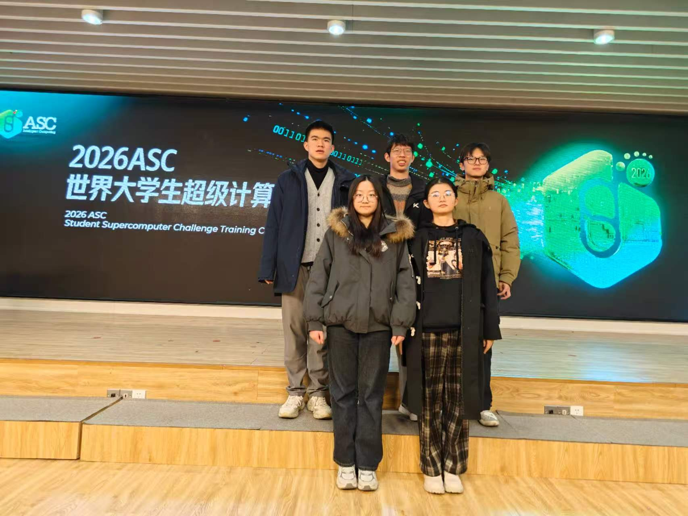
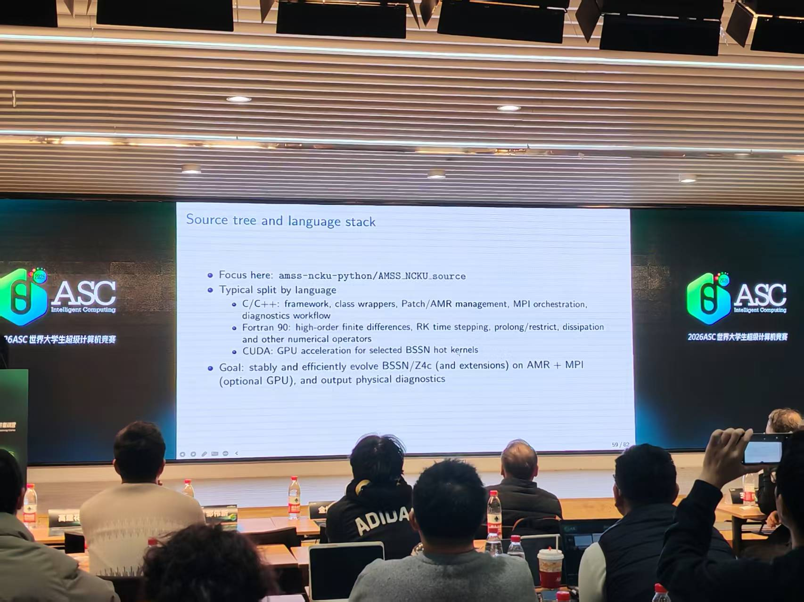
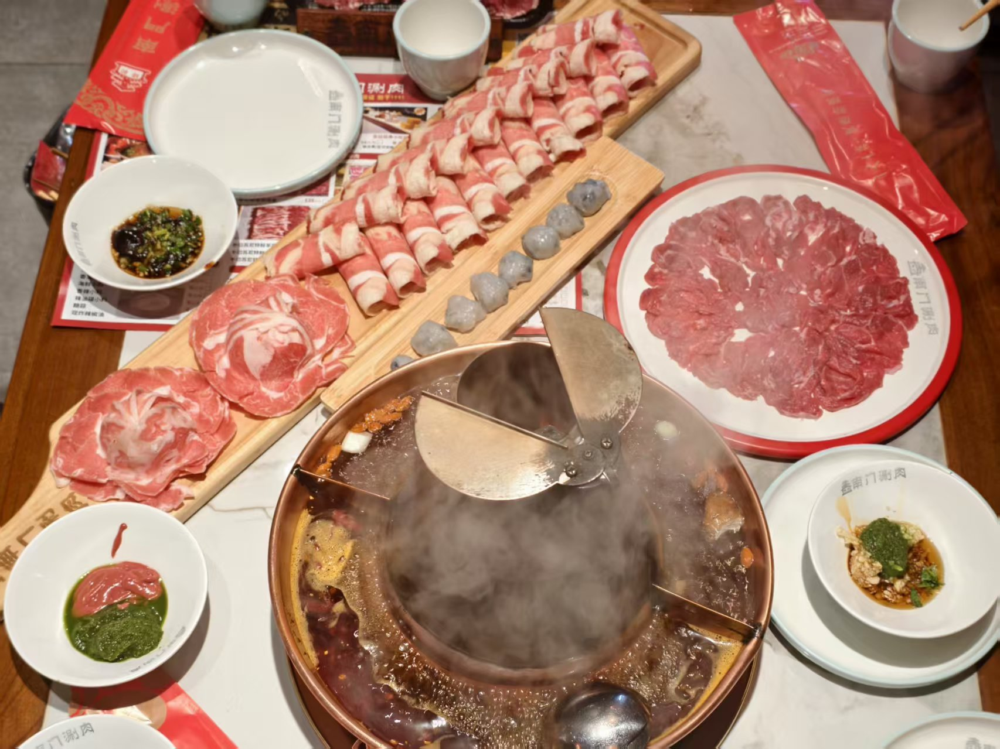
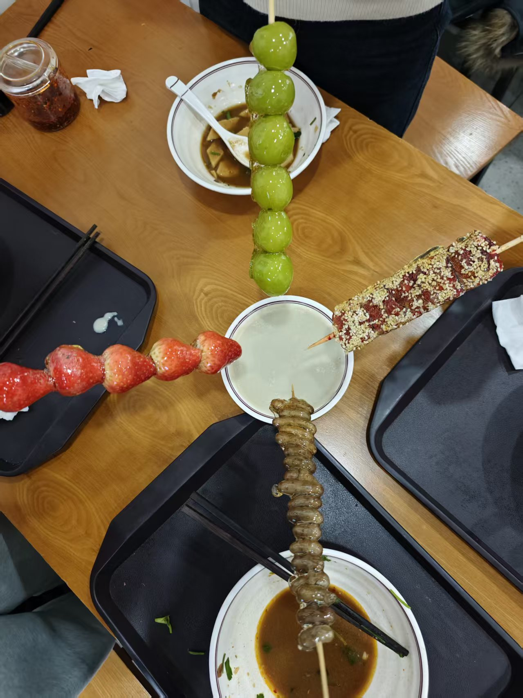

<!--more-->

为全力备战ASC竞赛，冲刺更好的比赛成绩，我们超算队集结北京，开启专项集训模式，专心打磨竞赛实力。
集训期间，队员们全身心投入，认真钻研超算技术、交流竞赛经验，针对性补齐备赛短板，全力以赴为赛事做好充足准备。

紧张的学习之余，当然少不了劳逸结合的快乐时刻！一起聚餐干饭，解锁北京特色糖葫芦，在忙碌的培训生活中，感受并肩同行的轻松与快乐。

闲暇傍晚，团队一同游览北京夜景，在放松休整中增进团队凝聚力，以更好的状态投入后续学习。

一趟充实的北京ASC集训，技能值拉满、团队默契值升级！接下来，超算队将带着满满的收获全力冲刺ASC竞赛，全力以赴，不负努力！
