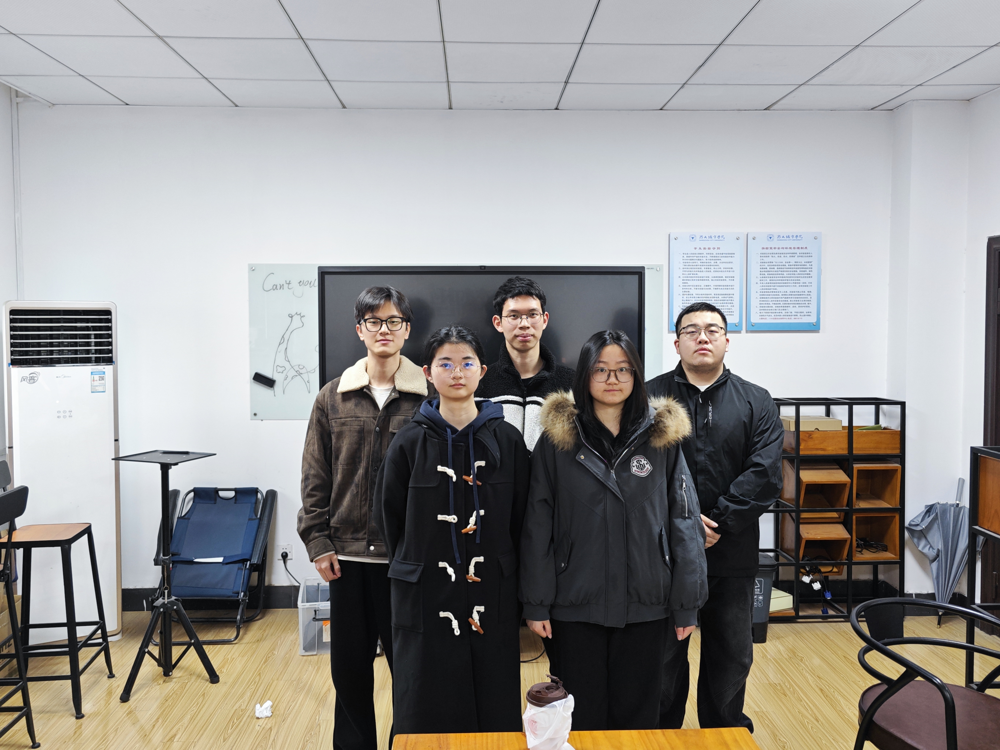
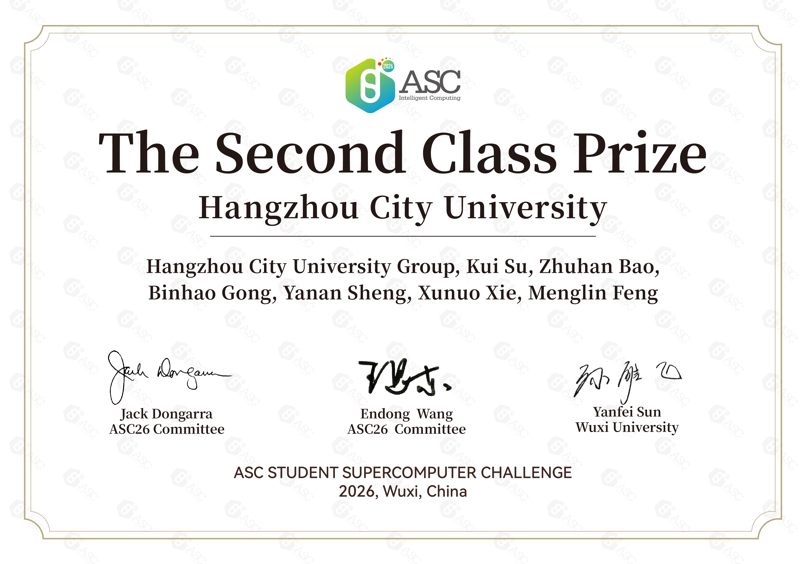
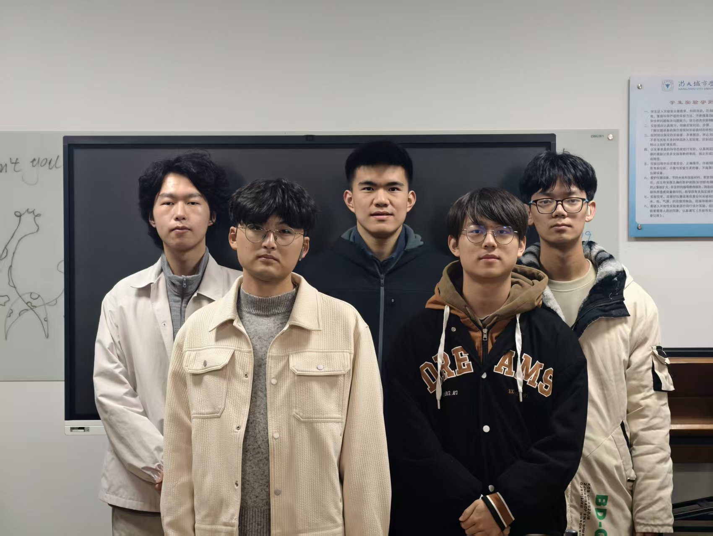
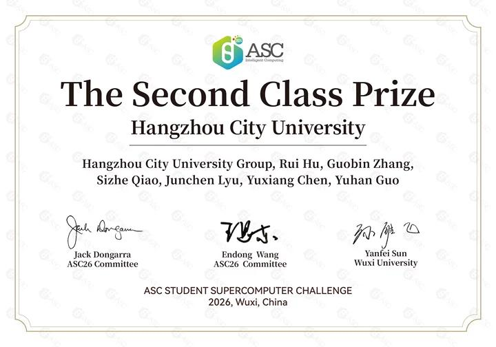

<!--more-->

## 赛事概况

ASC世界大学生超级计算机竞赛（ASC Student Supercomputer Challenge）创办于2012年，如今已跻身全球三大超算赛事之列，与美国SC、德国ISC齐名。过去十三年间，这项发轫于中国的高校竞赛，累计吸引了来自六大洲、超过300所高校的上万名学子报名参赛，参赛规模与地域覆盖在同类赛事中均属首位，早已成为全球超算领域最具活力的青年科创平台之一。

今年年初，第十三届ASC竞赛（ASC26）如期启动。本届预赛设置了两道极具前沿性的赛题——具身智能世界模型推理加速与引力波数值模拟。前者引入宇树科技研发的UnifoLM-WMA-0世界模型，要求参赛者在给定场景下优化模型推理效率并保证生成视频质量；后者则采用我国自主开发的数值相对论计算程序AMSS-NCKU，模拟双黑洞并合过程中引力波信号的产生与演化。这两道题目均脱胎于当前全球顶尖科研机构关注的真实问题，既考验并行计算与代码优化的硬功夫，也要求队员具备跨学科的理解能力。

此次比赛，我校超算队选派了两支队伍参与本届ASC26竞赛。队员们利用假期时间，在异构加速、通信优化与算法调优等方面反复打磨方案，与来自全球三百余支队伍同台竞技，经历了一场高强度的"脑力马拉松"。无论结果如何，这段在代码与集群之间日夜鏖战的经历本身，使队员们收获颇丰。

## 成绩展示

### 一队

成员：谢许诺，盛亚楠，鲍竹涵，冯梦琳，龚斌豪（从左至右）

### 二队

成员：乔思喆，吕俊辰，张国宾，陈宇翔，郭雨翰（从左至右）

